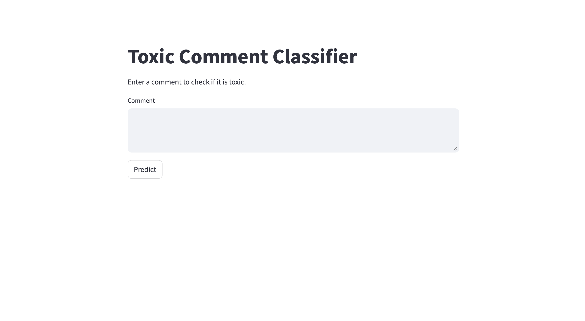

# Toxic Comment Classification

A machine learning project that detects toxic comments in online discussions using natural language processing techniques.

The system performs multi-label classification to identify different types of toxicity in comments such as:

- toxic
- severe_toxic
- obscene
- threat
- insult
- identity_hate

The project evaluates multiple text representations and machine learning models to identify the most effective approach for toxic comment detection.

## Dataset 
https://www.kaggle.com/c/jigsaw-toxic-comment-classification-challenge
Dataset: Jigsaw Toxic Comment Classification

- ~160,000 Wikipedia discussion comments
- Multi-label classification problem
- Highly imbalanced (≈90% non-toxic)

## Example Prediction

Input Comment

"You are a complete idiot"

Model Output

toxic: 1  
severe_toxic: 0  
obscene: 0  
threat: 0  
insult: 1  
identity_hate: 0

## Demo

An interactive web interface is provided using Streamlit.

Run the application locally:

```bash
streamlit run app.py
```


## Project Structure

```
toxic-comment-classifier/
│
├── data/            # raw dataset
├── embeddings/      # GloVe embeddings
├── features/        # processed feature matrices
├── models/          # trained models and vectorizers
├── notebooks/       # EDA and modeling notebooks
├── src/             # reusable preprocessing & feature code
│
├── predict.py       # prediction pipeline
├── app.py           # Streamlit interface
├── requirements.txt
└── README.md
```

## Project Pipeline

```
EDA → Text Cleaning → Feature Engineering
       ↓
Text Representations
(TF-IDF / Word2Vec / GloVe)
       ↓
Model Training
       ↓
Hyperparameter Tuning
       ↓
Error Analysis
       ↓
Final Model Selection

```

### Feature Engineering

In addition to text features, several linguistic features were extracted:

- word count
- sentence count
- uppercase usage
- punctuation count
- hashtag / mention count
- toxic keyword frequency

These features help capture stylistic patterns in toxic language.

### Text Representations

Three encoding approaches were evaluated:

| Method   | Description                         |
|----------|-------------------------------------|
| TF-IDF   | Frequency-based text representation |
| Word2Vec | Contextual word embeddings          |
| GloVe    | Pretrained global embeddings        |

### Models Evaluated

- Logistic Regression
- Naive Bayes
- Linear SVM
- Random Forest
- MLP Neural Network

Multi-label classification was implemented using OneVsRestClassifier.

### Results

Linear SVM performed best among all models.

Best configuration: Linear SVM + TF-IDF + Handcrafted Features
This hybrid representation achieved the highest F1 score and recall.

### Error Analysis

Key observations:
- Explicit profanity is detected reliably
- Subtle or contextual toxicity is harder to identify
- Minority classes such as threat and identity_hate are challenging due to severe class imbalance

### Technologies
- Python
- Scikit-learn
- Pandas
- NumPy
- Gensim
- Matplotlib / Seaborn

### Future Work

- Transformer models (BERT / RoBERTa)
- Better imbalance handling
- Context-aware toxicity detection
